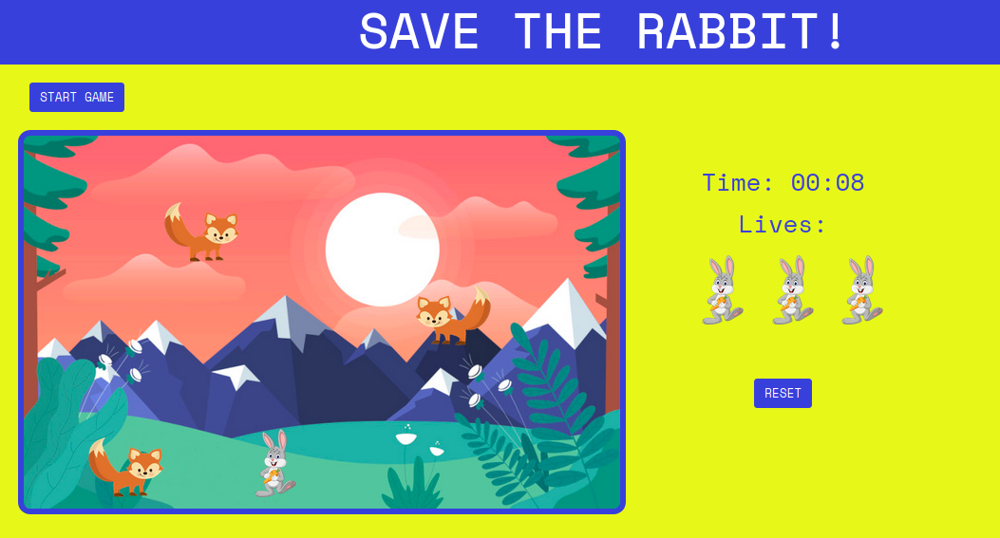

# Moving-blocks-game
Create a moving blocks game with JS

[Check out my game.](https://yurifra.github.io/Moving-blocks-game/)

- Repository: `Moving-blocks-game`
- Type of Challenge: `Learning Challenge`
- Duration: `2 days`
- Deployment strategy : `Github page`
- Team challenge : `solo`

## Learning objectives
- move DOM elements on the page
- react to keypresses
- collision detection

## The Mission
Have an object that you can move using the arrow keys. 
Have 4 other objects that move randomly around the screen.
When the player object hits the other objects he loses a life (3 lives) and when all his lives are gone he loses the game.
Show the time since the start how long he survived.

### Must-have features
- Ojbect that can be controlled
- Chasing squares
- Live mechanic

